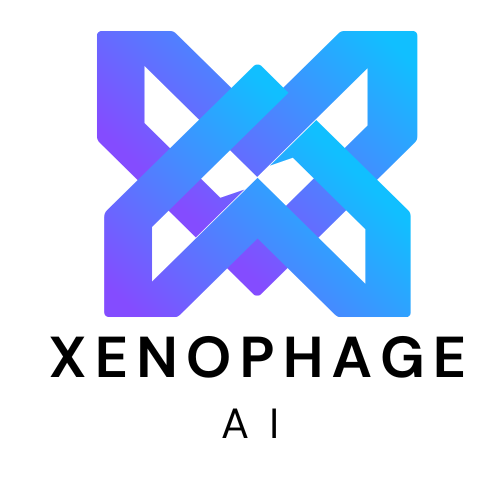
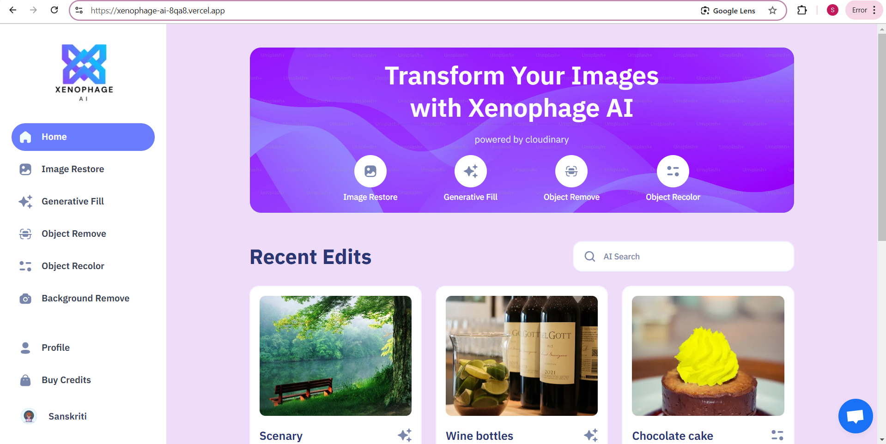

# XENOPHAGE AI



Xenophage AI is an advanced AI SaaS application for performing various image transformations using Cloudinary AI features. This platform allows users to restore images, apply generative fill, recolor objects, remove objects, remove backgrounds, and utilize AI-powered image search capabilities.

## Features

- **Image Restoration**: Enhance and restore old or damaged images.
- **Generative Fill**: Intelligently fill missing parts of an image.
- **Object Recoloring**: Change colors of specific objects in an image.
- **Object Removal**: Remove unwanted objects from images.
- **Background Removal**: Extract subjects from their backgrounds.
- **Cloudinary AI Search**: Perform AI-driven searches on images based on their content.

## Tech Stack

- **Next.js** - Frontend Framework
- **TypeScript** - Strongly typed JavaScript
- **Clerk** - Authentication Provider
- **Crisp** - Chat with Admin Support
- **Prisma ORM** - Database Management
- **MongoDB Atlas** - Cloud Database
- **Cloudinary** - AI-powered Image Transformations
- **Stripe** - Payment Processing
- **Tailwind CSS** - Styling
- **ShadCN UI** - UI Components

## Screenshots

Landing Page:



## Installation

1. Clone the repository:
   ```bash
   git clone https://github.com/your-repo/xenophage-ai.git
   ```
2. Navigate to the project directory:
   ```bash
   cd xenophage-ai
   ```
3. Install dependencies:
   ```bash
   npm install
   ```
4. Set up environment variables:
   - Create a `.env.local` file and add necessary credentials for Clerk, Cloudinary, Stripe, MongoDB, and other services.
5. Run the development server:
   ```bash
   npm run dev
   ```

For any inquiries or support, please contact [sanskriti.3026@gmail.com].
